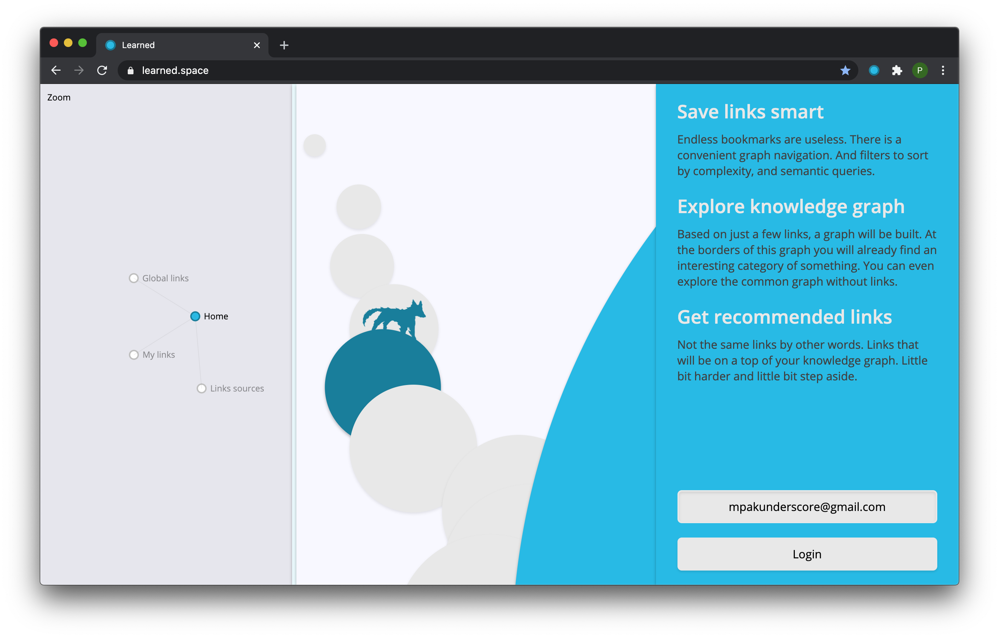
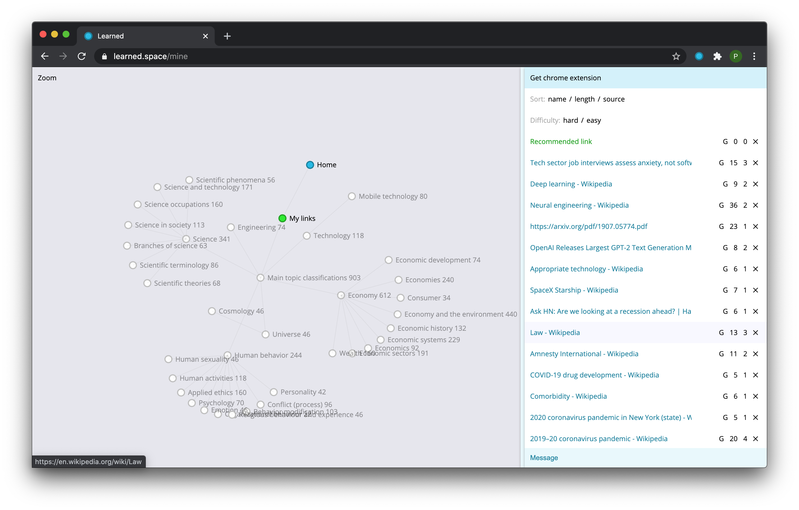
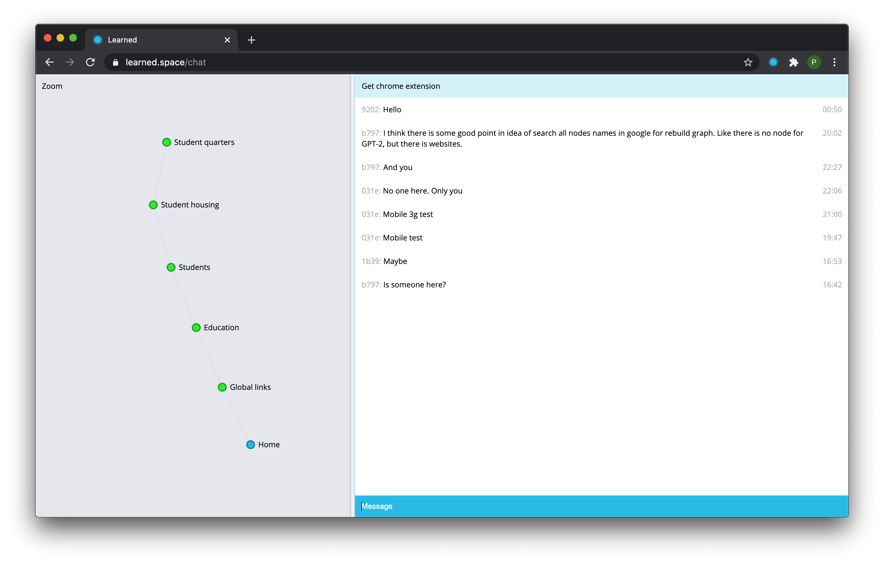

### Description
Links recommendation system. Focused on big texts and continuous learning process. With chatbots as a motivation help.

### Goal
Continuous learning process. I builded knowledge graph system based on incoming links. And a recommendation system based on it. To maintain the process of education I have to add non artificial agents to interact with users. I have to build different style chatbots to maintain the motivation process. Some engines with a user state of education process and text generation for non artificial feel.

&nbsp; | &nbsp;
--- | ---
|
|
|
|