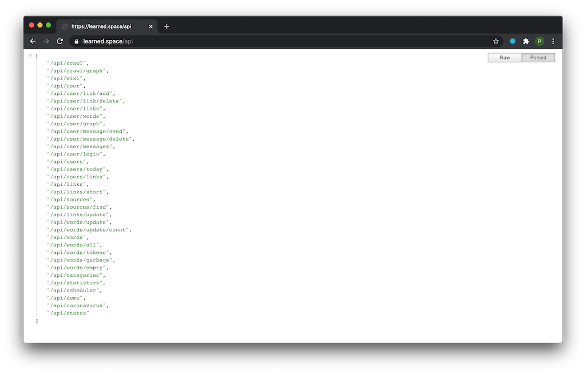

### Problem
Loss of сontinuing education process rate over time.

### Idea
We read a lot of links today. Perhaps this is the only thing we do for the sake of education today. This process is very chaotic, tied to other people and redundant in the form of noise information. Sometimes we come across very good links and they teach us something new. Sometimes we even bury ourselves in new knowledge and find the motivation to study this further.

This process already exists. We just need a new map.

### Solution
Links recommendation system with motivation grip. Focused on big texts and continuous learning process.

### Goal
Continuous learning process. To build a knowledge graph system based on incoming links. And a recommendation system based on it. To maintain the process of education we have to add non artificial agents to interact with users. We have to build different style chatbots to maintain the motivation process. Some engines with a user state of education process and text generation for non artificial feel.

&nbsp; | &nbsp;
--- | ---
|
&nbsp; | &nbsp;
|

### API (JSON) [learned.space/api](https://learned.space/api)

