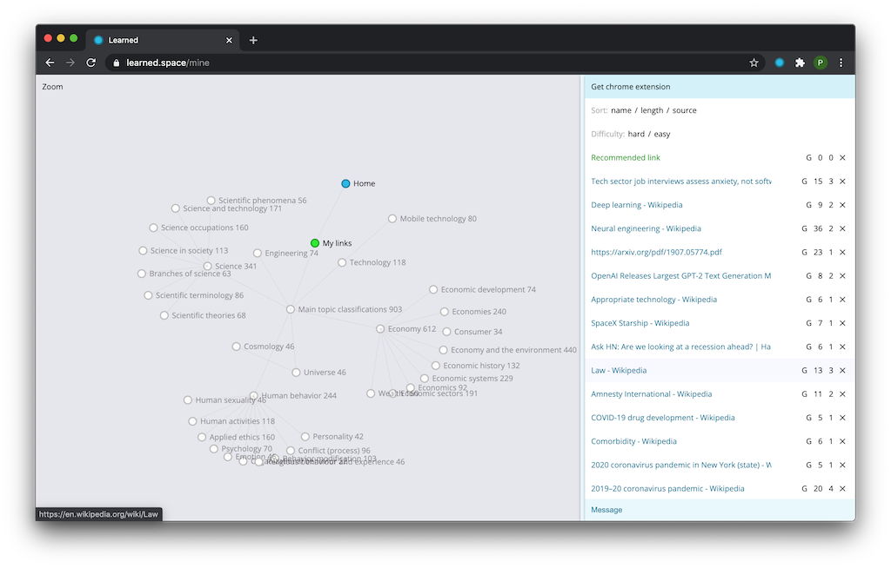
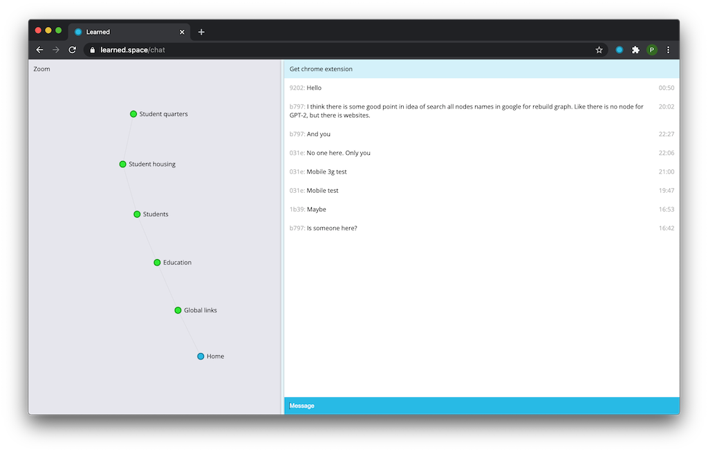
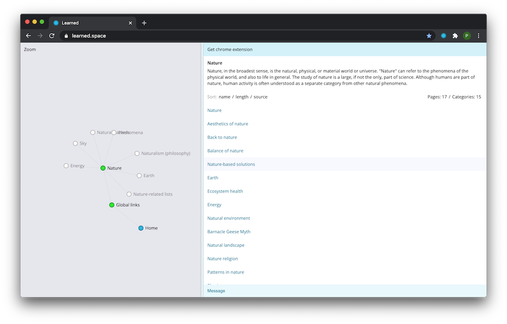

### Problem

Loss of сontinuing learning process rate over time.

### Idea

We read a lot of links today. Perhaps, this is the only thing we do for education. This process is very chaotic, tied to other people and redundant in the form of noise information. Sometimes we come across very good links and they teach us something new. Sometimes we even bury ourselves in new knowledge and find the motivation to study this further.

This process already exists. We just need a map and continuity.

### Solution

Links recommendation system with motivation grip. Focused on big texts and continuous learning process.

So, we need to build a knowledge graph for users, based on incoming links. And recommend a link (not that easy, especially to recommend interesting and needed links). To maintain the process of education we have to add artificial agents to interact with. Different style chatbots.

### State

#### Client
- [x] API
- [x] Simple login
- [x] Adaptive
- [x] Pages render
- [x] Graph navigation
- [x] Chrome extension
- [ ] Refactoring
- [ ] React
- [ ] Web mobile

#### Server
- [x] API
- [x] Database
- [x] Crawler
- [x] Text analysis
- [x] Login
- [x] Graph (have to be polished)
- [ ] Sources (currently here, to get more links)
- [ ] 1m links
- [ ] Simple recommendations from top of the user graph
- [ ] 1k sources
- [ ] YouTube subtitles

#### Chat
- [x] REST
- [ ] Socket
- [ ] External API
- [ ] User state model
- [ ] User behaviour model
- [ ] Bots chat group interaction
- [ ] Telegram bot

&nbsp; | &nbsp;
--- | ---
|
&nbsp; | &nbsp;
|

### API (JSON) [learned.space/api](https://learned.space/api)

